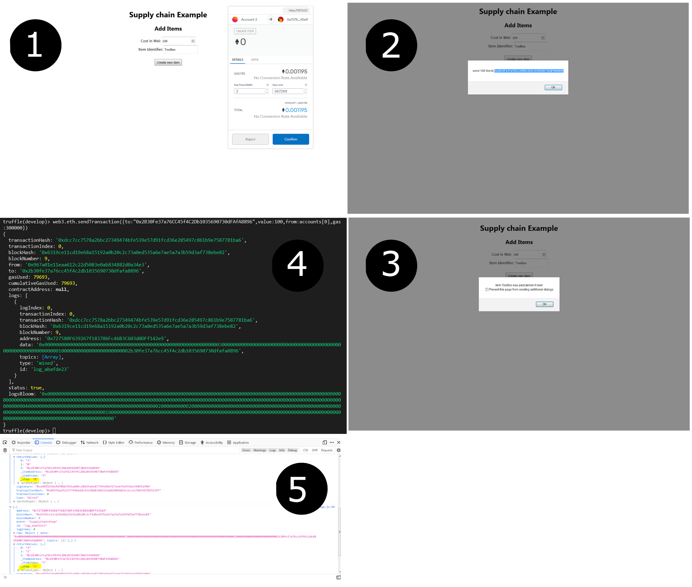

# SupplyChain-dApp
Project shows some real world use cases like it can be a part of supply chain solution, Automated Dispatch upon payment, Payment collection without middlemen.  
<b>Technologies used :</b> Truffle, HTML, Solidity , Metamask, Visual studio code.  
<b>Workflow:-</b>  
1. Item is created in supply chain by filling item name and price and pressing "Create New Item".  
2. After it gets created , alert box will show the message for sending ammount of Wei to smart contract address.  
3. 3rd screenshot shows you sending ammount of Wei to smart contract address, in this case "Item.sol" contract, this will trigger receive() function and receive() will  trigger triggerPayment() function whcih will change supplychain state of the item to "paid".  
4. 4th screenshot shows alert box for paid item with message "Item *itemname* was paid, deliver it now!".  
(The sending of Wei amount can be done also by any wallet like Metamask.) 
5. In 5th screenshot we can see the _step field in event which is getting changed after paying for item.  
  
<b>Screenshots:-</b>

