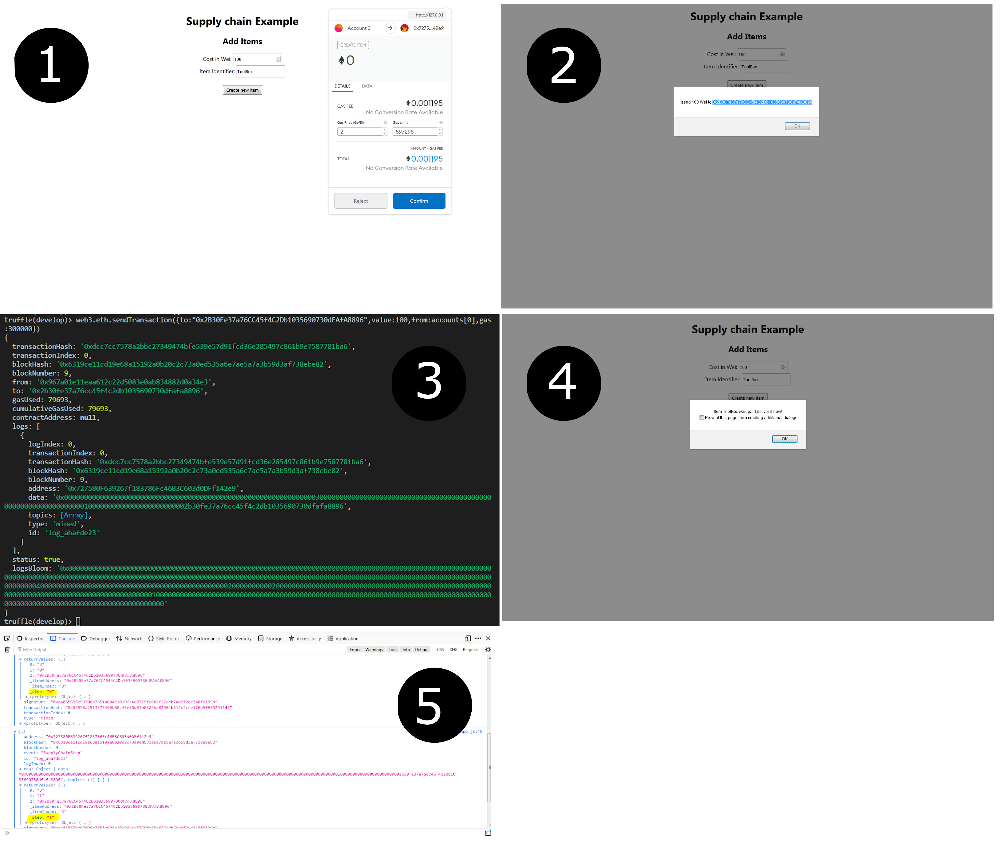

# SupplyChain-dApp
Project shows some real world use cases like it can be a part of supply chain solution, Automated Dispatch upon payment, Payment collection without middlemen.  
<b>Technologies used :</b> Truffle, HTML, Solidity , Metamask, Visual studio code.  
<b>Workflow:-</b>  
1.Item is created in supply chain by filling item name and price and pressing "Create New Item".  
2.
<b>Screenshots:-</b>

